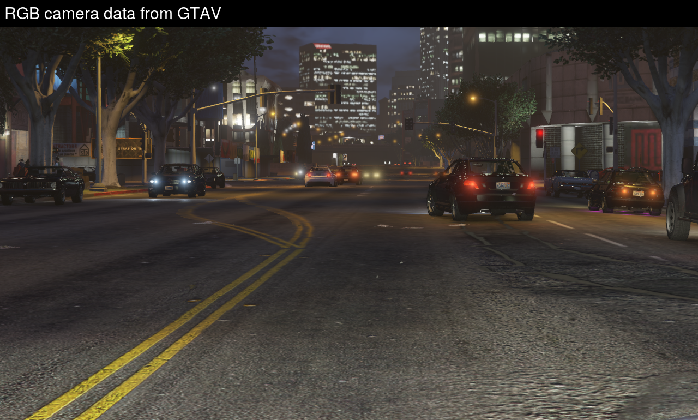
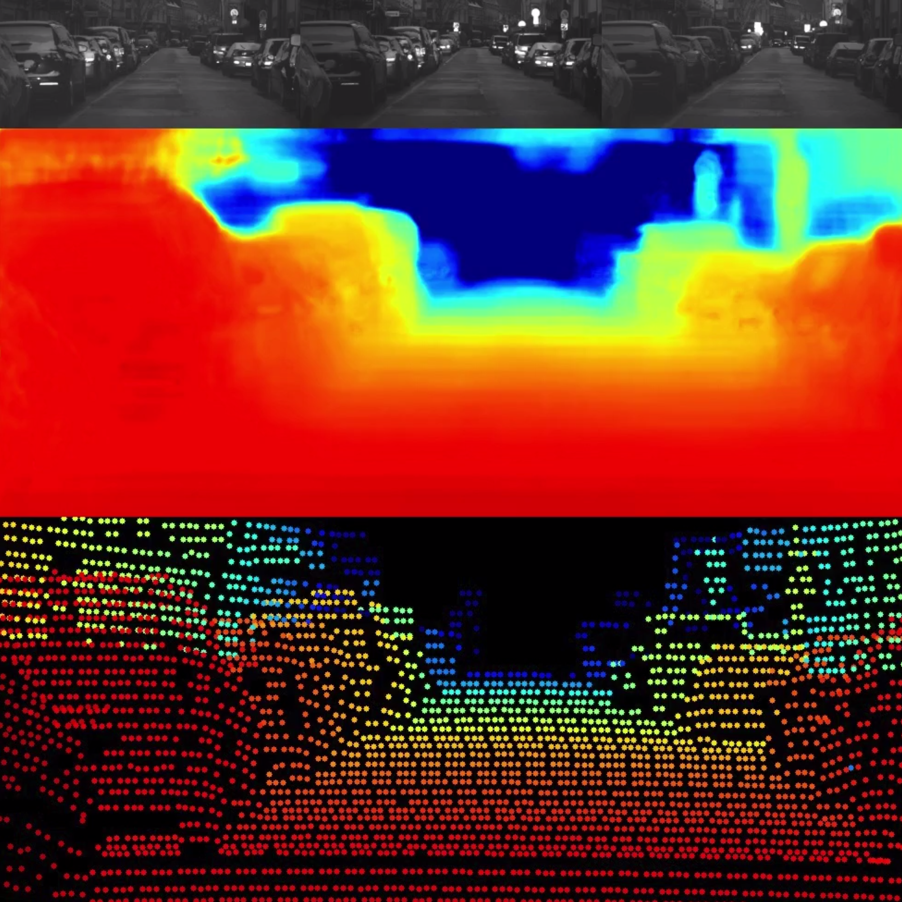
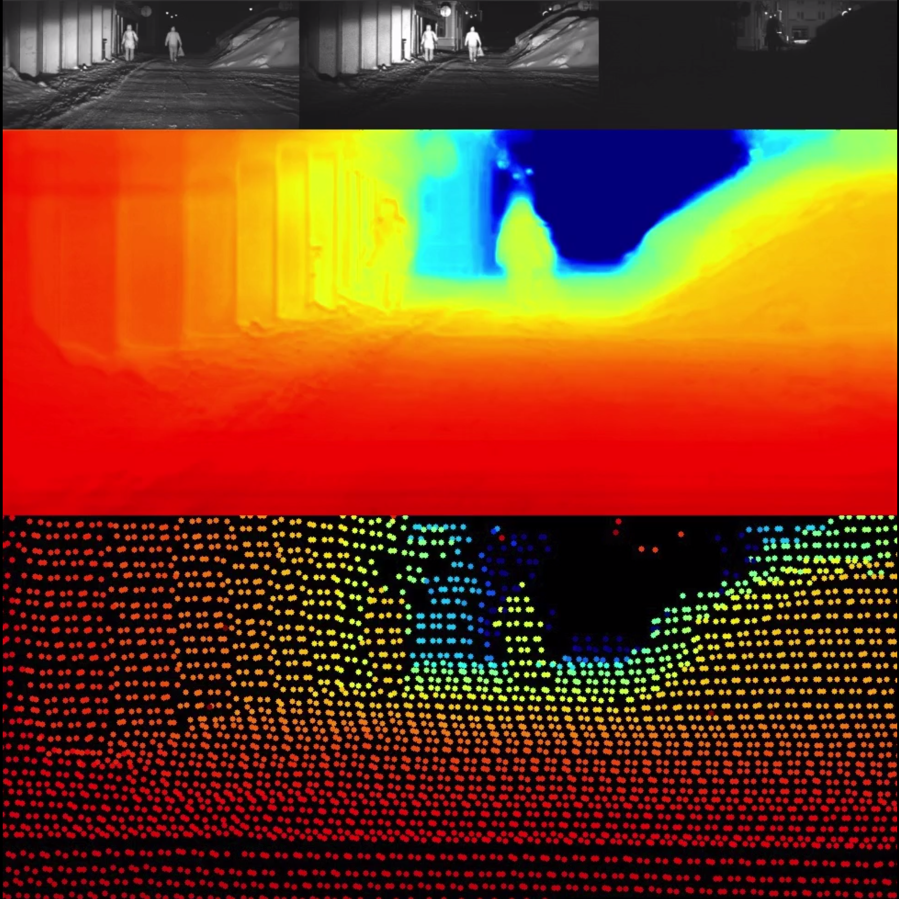

Gated2Depth
============================


This repository contains the code and data for [Gated2Depth: Real-Time Dense Lidar From Gated Images](https://arxiv.org/pdf/1902.04997.pdf).

Code and data will be available soon.

## Abstract
We present an imaging framework which converts three images from a gated camera into high-resolution depth maps with depth accuracy comparable to pulsed lidar measurements. Existing scanning lidar systems achieve low spatial resolution at large ranges due to mechanically-limited angular sampling rates, restricting scene understanding tasks to close-range clusters with dense sampling. Moreover, today's pulsed lidar scanners suffer from high cost, power consumption, large form-factors, and they fail in presence of strong backscatter. We depart from point scanning and demonstrate that it is possible to turn a low-cost CMOS gated imager into a dense depth camera with at least 80m range - by learning depth from three gated images. The proposed architecture exploits semantic context across gated slices, and is trained on a synthetic discriminator loss without the need of dense depth labels. The proposed replacement for scanning lidar systems is real-time, handles back-scatter and provides dense depth at long ranges. We validate our approach in simulation and on real-world data acquired over 4.000 km driving in northern Europe.

## Additional Material
### Gated Simulation

How we simulate gated images from GTAV.

[](https://drive.google.com/file/d/18vP4ss-CLfOR8YFMEFvTeBwL351zlxvD/view?usp=sharing "Gated Simulation Video")

### Results

We show the three gated images in the top row and the Gated2Depth output in the middle. For reference, projected lidar points are shown at the bottom.

#### Daytime Results

[](https://drive.google.com/file/d/1Aa1uoGnPSlrtMYokZJGOe9qaI_QnC8vB/view?usp=sharing "Daytime Results")

#### Nighttime Results

[](https://drive.google.com/file/d/1E7mc_QA3VGAH5fZ0dI9VZREifqBNKvg6/view?usp=sharing "Nighttime Results")


## Reference
If you find our work on gated depth estimation useful in your research, please consider citing our paper:
```
@inproceedings{gated2depth2019,
  title     = {Gated2Depth: Real-Time Dense Lidar From Gated Images},
  author    = {Gruber, Tobias and Julca-Aguilar, Frank and Bijelic, Mario and Heide, Felix},
  booktitle = {The IEEE International Conference on Computer Vision (ICCV)},
  year      = {2019}
}
```

## Acknowledgements
This work has received funding from the European Union under the H2020 ECSEL Programme as part of the DENSE project, contract number 692449.
