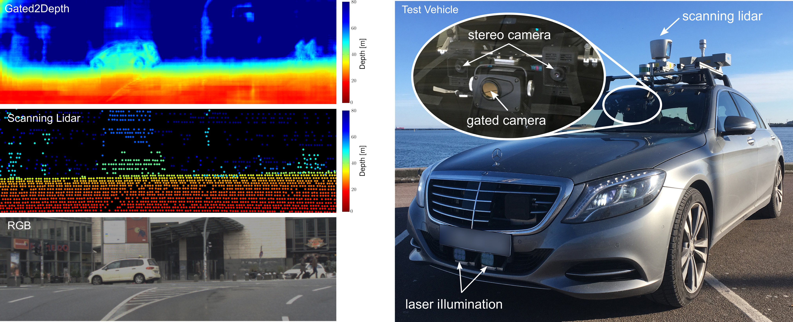

Gated2Depth
============================



This repository contains the code and data for [Gated2Depth: Real-Time Dense Lidar From Gated Images](https://arxiv.org/pdf/1902.04997.pdf).

NEWS: Coda and data are available now!

## Abstract
We present an imaging framework which converts three images from a gated camera into high-resolution depth maps with depth accuracy comparable to pulsed lidar measurements. Existing scanning lidar systems achieve low spatial resolution at large ranges due to mechanically-limited angular sampling rates, restricting scene understanding tasks to close-range clusters with dense sampling. Moreover, today's pulsed lidar scanners suffer from high cost, power consumption, large form-factors, and they fail in presence of strong backscatter. We depart from point scanning and demonstrate that it is possible to turn a low-cost CMOS gated imager into a dense depth camera with at least 80m range - by learning depth from three gated images. The proposed architecture exploits semantic context across gated slices, and is trained on a synthetic discriminator loss without the need of dense depth labels. The proposed replacement for scanning lidar systems is real-time, handles back-scatter and provides dense depth at long ranges. We validate our approach in simulation and on real-world data acquired over 4.000 km driving in northern Europe.

## Getting Started

Clone the benchmark code.
```
git clone https://github.com/gruberto/Gated2Depth
cd Gated2Depth
```

For running the evaluation and visualization code you need Python with the following packages:
- tensorflow
- numpy
- cv2
- matplotlib

We provide a conda environment to run our code.
```
conda env create -f environment.yaml
```

Activate conda environment.
```
conda activate gated2depth
```

Download the Gated2Depth dataset and the models from the [DENSE dataset webpage](https://www.uni-ulm.de/en/in/driveu/projects/dense-datasets). Please download the zip files of the synthetic and real dataset, and the models into separate folders.

Check if you have downloaded all files. Then, you can unzip your downloaded files.
```
bash scripts/unzip_real.sh <your_real_data_download_folder>
bash scripts/unzip_syn.sh <your_syn_data_download_folder>
bash scripts/unzip_models.sh <your_models_download_folder>
```

After unzipping the files, your directory should look like this:
```
.
|-- data
    |-- real
        |-- depth_hdl64_gated_compressed
        |-- gated0_10bit
        |-- gated1_10bit
        |-- gated2_10bit
        |-- rgb_left_8bit
        |-- rgb_right_8bit
    |-- sim
        |-- depth_compressed
        |-- gated0_10bit
        |-- gated1_10bit
        |-- gated2_10bit
        |-- rgb_left_8bit
        |-- rgb_right_8bit
|-- example
        |-- depth_hdl64_gated_compressed
        	|-- example.npz
        |-- gated0_10bit
        	|-- example.png
        |-- gated1_10bit
        	|-- example.png
        |-- gated2_10bit
        	|-- example.png
        |-- rgb_left_8bit
        	|-- example.png
|-- models
	|-- gated2depth_real_day
	|-- gated2depth_real_night
	|-- gated2depth_syn_day
	|-- gated2depth_syn_night
|-- splits
	|-- example.txt
        |-- real_test_day.txt
        |-- real_test_night.txt
	|-- real_train_day.txt
        |-- real_train_night.txt
	|-- real_val_day.txt
        |-- real_val_night.txt
        |-- syn_test_day.txt
        |-- syn_test_night.txt
	|-- syn_train_day.txt
        |-- syn_train_night.txt
	|-- syn_val_day.txt
        |-- syn_val_night.txt
|-- src
```

## Quick Example
Infer the depth for a single example:
```
./run_example.sh
```

## Training
Train a model on synthetic data from scratch with:
```
./run_train_syn.sh
```

Train a model on real data from scratch with:
```
./run_train_real.sh
```

Train a model that has been pretrained on synthetic data (pretrained model weights and fixed discriminator):
```
./run_train_real_pretrained.sh
```

## Evaluation
Evaluate on synthetic data. If you have not trained the models by yourself, make sure that you have downloaded our models into the "models" folder.
```
./run_eval_syn.sh
```

Evaluate on real data:
```
./run_eval_real.sh
```

## Additional Material
### Gated Simulation

How we simulate gated images from GTAV.


### Results

We show the three gated images in the top row and the Gated2Depth output in the middle. For reference, projected lidar points are shown at the bottom.

#### Daytime Results


#### Nighttime Results


## Reference
If you find our work on gated depth estimation useful in your research, please consider citing our paper:
```
@inproceedings{gated2depth2019,
  title     = {Gated2Depth: Real-Time Dense Lidar From Gated Images},
  author    = {Gruber, Tobias and Julca-Aguilar, Frank and Bijelic, Mario and Heide, Felix},
  booktitle = {The IEEE International Conference on Computer Vision (ICCV)},
  year      = {2019}
}
```

## Acknowledgements
This work has received funding from the European Union under the H2020 ECSEL Programme as part of the DENSE project, contract number 692449.
